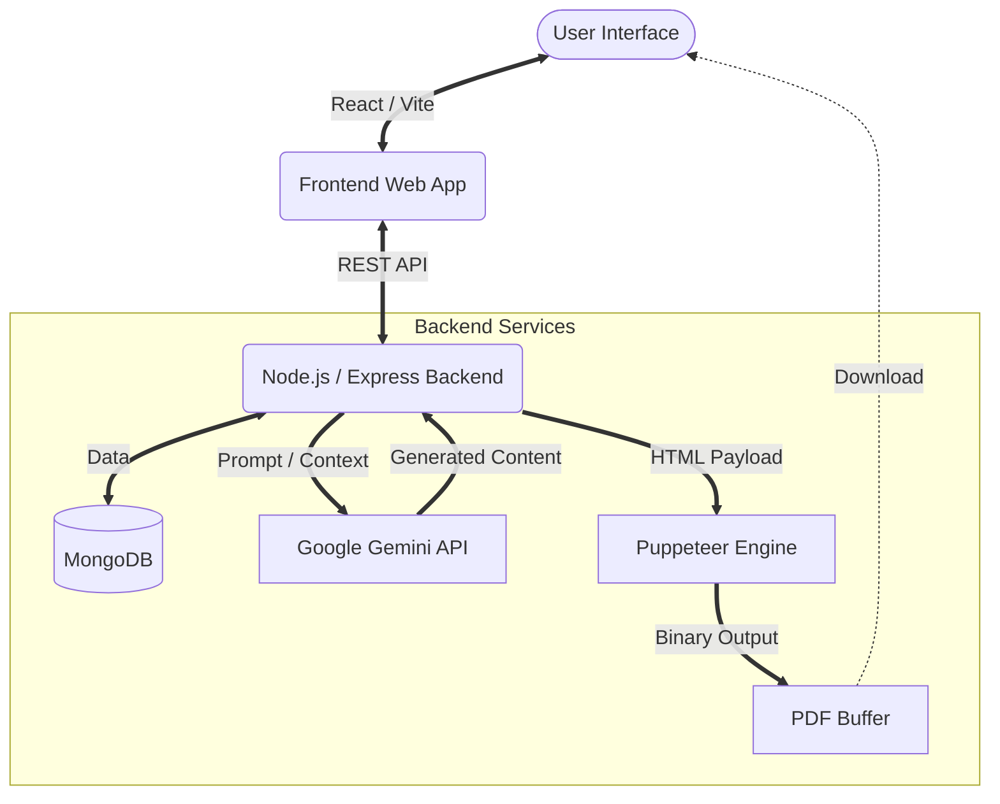

<div align="center">
  
</div>

<p align="center">
  
  
  
  
  
  
</p>

> A modern, full-stack web application that leverages Google's Generative AI to intelligently construct, format, and render professional resumes dynamically into PDF format.

---

## ✨ Features

- 🧠 **AI Content Generation:** Integrates directly with the `google/generative-ai` API (Gemini) to rewrite bullet points, generate professional summaries, and tailor content to specific job descriptions.
- 📄 **Dynamic PDF Rendering:** Utilizes a custom headless browser pipeline powered by **Puppeteer** to perfectly render HTML templates into ATS-friendly, 1-page PDF resumes.
- ⚛️ **Modern Frontend:** Built with React and Vite for a lightning-fast, highly responsive user interface that updates document previews in real-time.
- 🗄️ **Persistent Storage:** A secure Node.js/Express backend connected to a MongoDB database stores user profiles, previous resume versions, and customized templates.

---

## 🏗️ System Architecture

The application follows a standard MERN stack architecture, supercharged with server-side browser rendering and LLM integration.



---

## 📸 Screenshots

*(Drag and drop your screenshots here!)*

| Resume Editor | PDF Output Preview |
|:---:|:---:|
| *(Replace with Editor Image)* | *(Replace with PDF Image)* |

---

## 🚀 Quick Start

### 📋 Prerequisites
- **Node.js** (v18+)
- **MongoDB** (Local instance or MongoDB Atlas cluster)
- **Google Gemini API Key**

### 1️⃣ Backend Setup
```bash
cd backend
npm install
```
Create a `.env` file in the `backend` directory:
```env
PORT=5000
MONGODB_URI=your_mongodb_connection_string
GEMINI_API_KEY=your_gemini_api_key
```
Start the server:
```bash
npm run dev
```

### 2️⃣ Frontend Setup
Open a new terminal window:
```bash
cd frontend
npm install
```
Start the Vite development server:
```bash
npm run dev
```

The application will now be running at `http://localhost:5173`.

---

## 🎓 About

Developed by **Mohamad Atamleh** <br/>
[GitHub](https://github.com/MohamadAtamneh404) | [LinkedIn](https://linkedin.com/in/mohamad-atamleh-a43185381)
