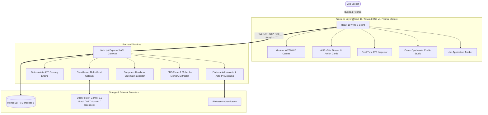
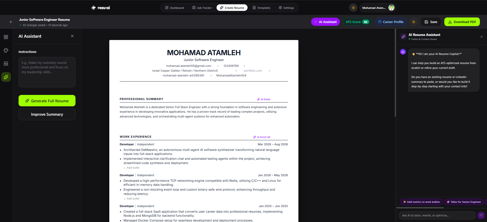
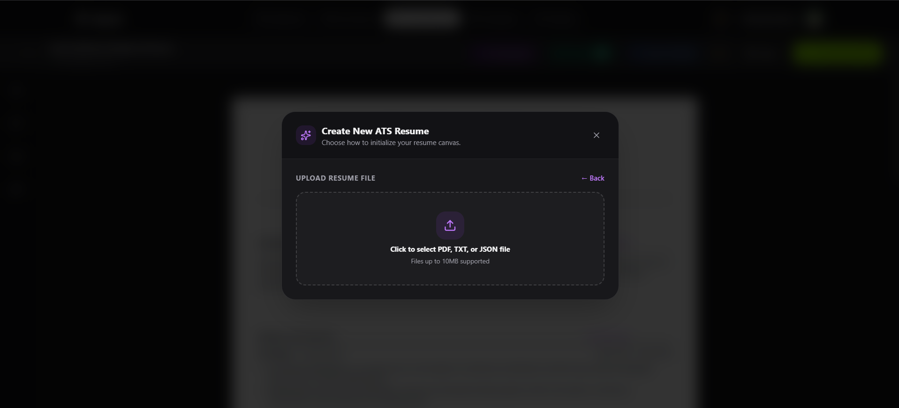
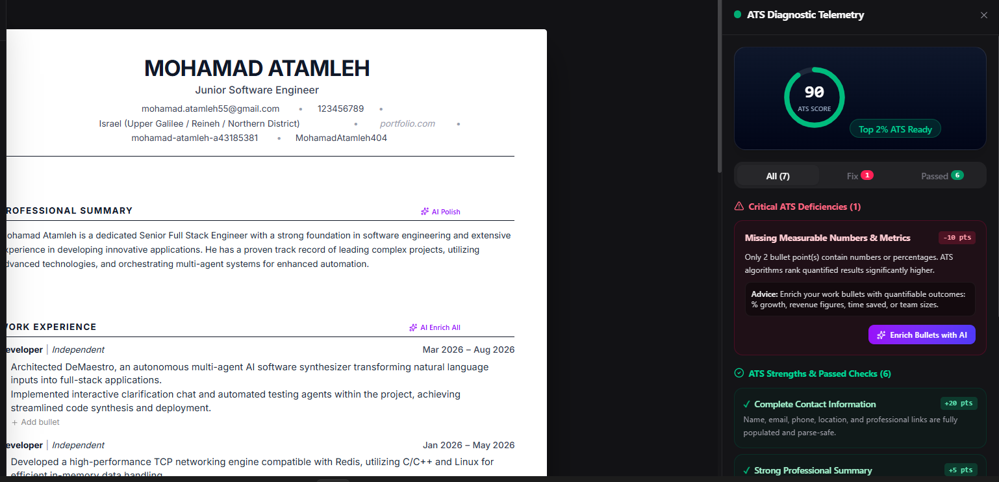
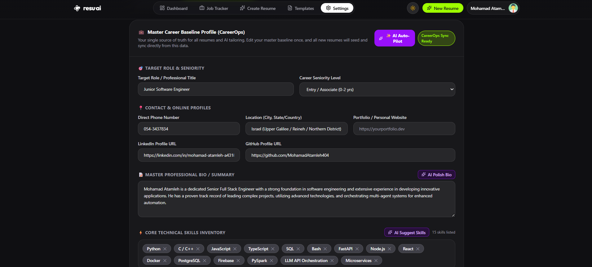

<div align="center">
  
</div>

<p align="center">
  
  
  
  
  
  
  
  
  
  
</p>

> **AI-Powered Resume Builder & CareerOps Studio** is an enterprise-grade, full-stack platform designed to craft high-impact, machine-readable, ATS-optimized resumes. Combining a modular **WYSIWYG live editor**, a centralized **CareerOps** single-source-of-truth baseline, a context-aware **AI Co-Pilot** with interactive 1-click action proposals, a real-time **4-pillar ATS audit engine**, and a full-lifecycle **Job Application Tracker**, this platform empowers job seekers to pass modern Applicant Tracking Systems (Workday, Greenhouse, Lever, Taleo) and land interviews faster.

---

## 🖼️ Hero Section

<p align="center">
  
</p>

---

## 🛠️ Tech Stack & Architecture

### System Architecture

The platform is structured with a decoupled client-server model, containerized via Docker Compose, and orchestrated with an intelligent multi-model AI gateway:



### Technologies Used

| Domain | Technology | Purpose & Highlights |
| :--- | :--- | :--- |
| **Frontend Framework** | [React 19](https://react.dev/) + [Vite 7](https://vitejs.dev/) | Blazing fast HMR, cutting-edge concurrent features, and optimized production bundle |
| **Styling & UI** | [Tailwind CSS v4](https://tailwindcss.com/) | Next-generation utility engine with instant compile times and theme tokens |
| **Interactions & Drag-and-Drop** | [@dnd-kit](https://dndkit.com/) | Accessible, smooth vertical drag-and-drop section reordering |
| **Animations & 3D** | [Framer Motion](https://www.framer.com/motion/) & [Three.js](https://threejs.org/) / [OGL](https://github.com/oframe/ogl) | Route transitions, micro-interactions, and 3D circular hero templates gallery |
| **Backend Runtime** | [Node.js](https://nodejs.org/) & [Express 5](https://expressjs.com/) | Robust RESTful architecture with centralized validation and global error handling |
| **Database & ODM** | [MongoDB 7](https://www.mongodb.com/) & [Mongoose 8](https://mongoosejs.com/) | Document persistence with indexed queries, nested schemas, and user telemetry |
| **AI Multi-Model Routing** | [OpenRouter](https://openrouter.ai/) / [Google Gemini](https://ai.google.dev/) | Automatic fallback routing across `gemini-2.5-flash`, `gpt-4o-mini`, and `deepseek-chat` |
| **PDF Generation** | [Puppeteer](https://pptr.dev/) & [react-to-print](https://github.com/gregnb/react-to-print) | Dual-engine: client-side vector printing & server-side pixel-perfect A4 headless Chromium rendering |
| **Document Parsing** | [pdf-parse](https://www.npmjs.com/package/pdf-parse) & [Multer](https://github.com/expressjs/multer) | In-memory extraction of raw text from uploaded resumes and CVs |
| **Data Export/Import** | [SheetJS (xlsx)](https://sheetjs.com/) | Bidirectional Excel spreadsheet import and export for job tracking records |
| **Authentication** | [Firebase Authentication](https://firebase.google.com/) & Firebase Admin | JWT token authentication with auto-provisioning and session refresh interceptor |
| **DevOps & Containers** | [Docker](https://www.docker.com/) & Docker Compose | Isolated multi-container environments (`mongodb`, `backend`, `frontend`) |

---

## ✨ Key Features

![Platform Features Overview](
### Visual Showcase

| WYSIWYG Resume Canvas & Controls | AI Co-Pilot & 1-Click Action Proposals |
| :---: | :---: |
|  |  |

| Real-Time ATS Audit & 1-Click AI Fixes | Master CareerOps Baseline Profile |
| :---: | :---: |
|  |  |

---

### 1. 🎯 Modular WYSIWYG Resume Canvas
- **Fluid Inline Editing:** Edit names, job titles, summaries, dates, bullet points, and skills directly inside the rendered resume layout.
- **Drag-and-Drop Section Reordering:** Powered by `@dnd-kit`, freely reorder, toggle, duplicate, or delete any of the **11 core sections**:
  - `Header & Contact Info`, `Executive Summary`, `Work Experience`, `Education`, `Skills`, `Projects & Portfolio`, `Awards & Honors`, `Volunteer Work`, `Publications`, `Languages`, and `Interests`.
- **Adaptive Visual Controls:** Real-time font-size, layout spacing, margin controls, and dynamic accent color customization.

### 2. 🤖 Context-Aware AI Co-Pilot & 1-Click Action Proposals
- **Strictly Grounded in Draft State:** The AI Co-Pilot drawer is continuously aware of your live resume state (contact readiness, summary length, experience count, skills density).
- **1-Turn Automatic Full-Resume Blueprint:** Paste raw notes, past resumes, or LinkedIn profile text to auto-populate your entire baseline in seconds without tedious multi-turn interrogation.
- **Interactive Action Envelopes:** AI suggestions arrive as discrete visual proposal cards:
  - `<<act:setContactInfo>>`, `<<act:updateSummary>>`, `<<act:addExperience>>`, `<<act:updateSkills>>`, `<<act:generateResume>>`.
- **1-Click "Apply All":** Inspect diffs before committing, or click **"Apply All"** to merge all AI-generated sections into your canvas simultaneously.

### 3. 🛡️ Real ATS Audit Engine & 1-Click AI Fixes
- **4-Pillar Comprehensive Scoring (0–100):** Evaluates Keyword Match & Density, Syntax & Layout Compliance, Action Verbs & Quantified Metrics, and Section Completeness.
- **Automated Deficiency Repair:** Next to every identified ATS vulnerability, a dedicated **"Fix with AI"** button automatically rewrites weak bullet points, injects quantifiable impact, or embeds missing industry keywords.
- **Real-Time Parser Simulation:** Identifies parsing bottlenecks before applicant tracking algorithms reject your application.

### 4. 📂 CareerOps Master Baseline Profile Studio
- **Single Source of Truth:** Centralized database holding your entire career history, verified corporate employment, education, target roles, seniority level, and contact details.
- **Strict Separation of Work vs. Projects:** Intelligent guardrails ensure that open-source work, academic projects, and freelance apps are cataloged strictly under **Projects**, keeping employment histories clean for enterprise background checks.
- **Auto-Pilot Profile Ingestion:** Ingest raw career notes or past resumes with auto-population of full credentials.
- **AI Career Polishing Tools:** Dedicated actions to *Polish Bio*, *Suggest High-Demand Skills*, and *Enrich Work Bullets with Metrics*.

### 5. 📄 ATS-Tested Built-in Templates
- **ATS Classic:** 100% ATS-compliant single-column layout, tested against Workday, Greenhouse, and Lever.
- **ATS Modern Accent:** Crisp accent borders with contemporary sans-serif typography and zero parser penalties.
- **ATS Executive Serif:** Centered layout featuring Georgia serif typography designed for leadership and C-suite roles.
- **ATS Tech & Developer:** Monospace badges and skill-first prioritization engineered specifically for software engineers.
- **ATS Compact 1-Page:** High-density layout engineered to consolidate extensive careers into a single page without overflowing.

### 6. 🖨️ Multi-Engine PDF Export with Embedded Metadata
- **Server-Side Puppeteer Engine:** Generates vector-sharp A4 PDF documents rendered with headless Chromium.
- **Embedded ATS JSON-LD Metadata:** Automatically embeds `<script type="application/ld+json">` Schema.org `Person` metadata directly into the exported document for automated ATS ingestion.
- **Instant Client-Side Print:** Fallback vector printing via `@media print` CSS and `react-to-print`.

### 7. 💼 Integrated Job Application Tracker
- **End-to-End Application Pipeline:** Track application status across **Saved**, **Applied**, **Interview**, **Offer**, and **Rejected** stages.
- **Inline Table Management:** Quickly edit companies, roles, application dates, URLs, salary expectations, and personal notes.
- **Excel Spreadsheet Export:** Export your entire job search funnel directly to `.xlsx` using SheetJS.
- **Conversion Rate Analytics:** Real-time metrics calculating interview conversion percentages and application velocity over 7-day rolling windows.

### 8. ⚙️ AI Persona Tuning & Live Resource Telemetry
- **Customizable AI Tone:** Switch between **Outcome & Metrics-Driven**, **Direct & Highly Technical**, or **Executive & Strategic**.
- **Keyword Density Slider:** Fine-tune target keyword density from 65% to 98%.
- **Live Resource Quotas:** Real-time telemetry tracking active resumes created, AI rewrites utilized, and ATS scans performed with automated 30-day billing cycle resets.

---

## 🚀 Installation & Getting Started

### Prerequisites
- **Node.js** (v18.x or v20.x+ recommended)
- **MongoDB** (Local MongoDB instance or [MongoDB Atlas](https://www.mongodb.com/atlas))
- **Docker & Docker Compose** (Optional, for containerized execution)
- **OpenRouter API Key** (or Google Gemini API key)

---

### Step 1: Clone the Repository
```bash
git clone https://github.com/MohamadAtamneh404/AI-Powered-Resume-Builder.git
cd AI-Powered-Resume-Builder
```

---

### Step 2: Environment Configuration

Create a `.env` file in the `BackEnd/` directory by copying the example:

```bash
cp BackEnd/.env.example BackEnd/.env
```

Populate the required environment variables:

```env
# Server Configuration
PORT=3000
FRONTEND_ORIGIN=http://localhost:5173

# Database
MONGO_URI=mongodb://localhost:27017/ai_resume

# Authentication
JWT_SECRET=your_super_secret_jwt_key_here
FIREBASE_PROJECT_ID=resuai-da972

# OpenRouter & Gemini AI Gateway
OPENROUTER_API_KEY=your_openrouter_api_key_here
OPENROUTER_MODELS=google/gemini-2.5-flash,openai/gpt-4o-mini,deepseek/deepseek-chat
OPENROUTER_MAX_TOKENS=2500
OPENROUTER_TEMPERATURE=0.7

# Email Notifications (Optional)
EMAIL_HOST=smtp.example.com
EMAIL_PORT=587
EMAIL_USER=your_email@example.com
EMAIL_PASS=your_email_password
```

---

### Step 3: Seed Built-in Templates
Before launching the application for the first time, populate the MongoDB database with the default ATS templates:

```bash
cd BackEnd
npm install
npm run seed
cd ..
```

---

### Step 4: Run Locally (Development Mode)

#### 1. Start the Backend API:
```bash
cd BackEnd
npm run dev
```
> The backend server will start on `http://localhost:3000`.

#### 2. Start the Frontend Client:
In a separate terminal window:
```bash
cd FrontEnd
npm install
npm run dev
```
> The Vite development server will start on `http://localhost:5173`.

---

### Step 5: Run with Docker Compose (Alternative)

To build and launch all services (`mongodb`, `backend`, `frontend`) in isolated containers:

```bash
docker compose up --build
```

- **Frontend Client:** [http://localhost:5173](http://localhost:5173)
- **Backend API:** [http://localhost:3000](http://localhost:3000)
- **MongoDB Database:** `mongodb://localhost:27018`

---

## 🔌 API Endpoints & Usage

All backend routes are mounted under the `/api` prefix (proxied automatically by Vite during local development).

### 🔐 Authentication & Profile (`/api/users` & `/api/user`)

| Method | Endpoint | Auth | Description |
| :--- | :--- | :---: | :--- |
| `POST` | `/api/users/register` | No | Creates a MongoDB user record synchronized with Firebase Auth UID |
| `GET` | `/api/users/me` | Yes | Retrieves current authenticated user profile |
| `GET` | `/api/users/photo/:email` | No | Fetches public profile avatar by email |
| `GET` | `/api/user/profile` | Yes | Fetches user profile, settings, and live usage telemetry |
| `PUT` | `/api/user/profile` | Yes | Updates name, avatar, and password credentials |
| `PUT` | `/api/settings/settings` | Yes | Updates ATS preferences and AI Copilot tone / keyword density |
| `GET` | `/api/settings/career-profile` | Yes | Retrieves the CareerOps Master Baseline Profile |
| `PUT` | `/api/settings/career-profile` | Yes | Updates the CareerOps Master Baseline Profile |
| `POST` | `/api/settings/subscription` | Yes | Updates subscription tier or resets monthly usage quota |

---

### 📄 Resume Management & Export (`/api/resumes`)

| Method | Endpoint | Auth | Description |
| :--- | :--- | :---: | :--- |
| `GET` | `/api/resumes` | Yes | Lists all resumes belonging to the authenticated user (paginated) |
| `POST` | `/api/resumes` | Yes | Creates a new resume instance |
| `GET` | `/api/resumes/:id` | Yes | Retrieves a single resume document by ID |
| `PUT` | `/api/resumes/:id` | Yes | Updates an existing resume's content, layout, blocks, or theme |
| `DELETE` | `/api/resumes/:id` | Yes | Deletes a resume document |
| `POST` | `/api/resumes/export-pdf` | No | Generates an A4 PDF via Puppeteer with optional embedded JSON-LD metadata |
| `POST` | `/api/resumes/render` | Yes | Renders a resume using JSON Resume theme engines |

---

### 🤖 AI Generation & Co-Pilot (`/api/ai` & `/api/tailor`)

| Method | Endpoint | Auth | Description |
| :--- | :--- | :---: | :--- |
| `POST` | `/api/ai` | Optional | Multi-scope AI generation (`chat-assistant`, `summary`, `work`, `full`, `improve-section`, `skills-suggest`, `career-ops`) |
| `POST` | `/api/ai/upload-resume` | Optional | Ingests PDF or raw text and extracts structured profile data via AI |
| `POST` | `/api/ai/ats/check` | Optional | Audits resume data against a target job description and returns scores + missing keywords |
| `POST` | `/api/tailor` | Yes | Compares a saved resume against a job description and suggests section-specific enhancements |

#### Example: Chat Assistant & Action Envelope Request
```bash
curl -X POST http://localhost:3000/api/ai \
  -H "Content-Type: application/json" \
  -H "Authorization: Bearer <FIREBASE_ID_TOKEN>" \
  -d '{
    "scope": "chat-assistant",
    "message": "Here are my notes: Worked at Stripe as Backend Lead 2022-2024, built payment pipelines in Go. Education: BS CS at Berkeley 2021.",
    "draftState": { "hasContact": false, "hasSummary": false, "experienceCount": 0 }
  }'
```

#### Example Response:
```json
{
  "reply": "I have extracted your background and prepared your complete ATS resume blueprint.\n\n<<act:setContactInfo {\"targetTitle\":\"Backend Lead\"}>>\n<<act:addExperience {\"company\":\"Stripe\",\"role\":\"Backend Lead\",\"dates\":\"2022 - 2024\",\"bullets\":[\"Architected resilient payment pipelines using Go, scaling transaction throughput by 40%.\"]}>>\n<<act:generateResume {...}>>",
  "patch": null
}
```

---

### 💼 Job Application Tracker (`/api/jobs`)

| Method | Endpoint | Auth | Description |
| :--- | :--- | :---: | :--- |
| `GET` | `/api/jobs` | Yes | Lists all job applications tracked by user |
| `GET` | `/api/jobs/stats` | Yes | Calculates weekly job addition count and interview conversion rate |
| `POST` | `/api/jobs` | Yes | Creates a new tracked job application |
| `PUT` | `/api/jobs/:id` | Yes | Updates a job application (status, dates, salary, notes) |
| `DELETE` | `/api/jobs/:id` | Yes | Deletes a job application record |
| `PATCH` | `/api/jobs/:id/archive` | Yes | Archives an individual job application |
| `POST` | `/api/jobs/bulk` | Yes | Bulk operations (`archive` or `delete`) for multiple job IDs |

---

### 📊 Analytics & Templates (`/api/analytics` & `/api/templates`)

| Method | Endpoint | Auth | Description |
| :--- | :--- | :---: | :--- |
| `GET` | `/api/analytics/stats` | Yes | Aggregates application counts, average ATS score across resumes, and interviews |
| `GET` | `/api/templates` | No | Retrieves all built-in ATS resume templates |
| `GET` | `/api/templates/:id` | No | Retrieves template definition and layout schema by ID |

---

## 📜 Scripts Reference

### Backend Scripts (`BackEnd/package.json`)
- `npm run dev`: Starts the backend server with `nodemon` hot reloading.
- `npm run start`: Starts the backend server in production mode.
- `npm run seed`: Executes `scripts/seedTemplates.js` to seed ATS templates into MongoDB.
- `npm run lint`: Runs ESLint across the backend codebase.
- `npm run lint:fix`: Automatically fixes ESLint rule violations.
- `npm run format`: Formats code using Prettier.

### Frontend Scripts (`FrontEnd/package.json`)
- `npm run dev`: Starts the Vite local development server.
- `npm run build`: Bundles the client for production deployment.
- `npm run preview`: Previews the production build locally.
- `npm run lint`: Runs ESLint on React components and JSX.
- `npm run format`: Formats frontend files using Prettier.

---

## 📄 License & Acknowledgments

This project is licensed under the [ISC License](LICENSE).

### Author & Maintainer
- **Mohamad Atamleh**
  - GitHub: [@MohamadAtamneh404](https://github.com/MohamadAtamneh404)
  - LinkedIn: [Mohamad Atamleh](https://linkedin.com/in/mohamad-atamleh-a43185381)

### Acknowledgments
- [OpenRouter](https://openrouter.ai/) for resilient, multi-model AI orchestration.
- [Google Generative AI](https://ai.google.dev/) for high-throughput language generation.
- [Puppeteer](https://pptr.dev/) for server-side Chromium PDF rendering.
- [dnd kit](https://dndkit.com/) for modern drag-and-drop mechanics in React.
- [Tailwind CSS](https://tailwindcss.com/) for intuitive, modern interface styling.
- [SheetJS](https://sheetjs.com/) for frictionless spreadsheet data interoperability.
